# 🚀 21 Days AI/ML Learning Journey

This repository documents my comprehensive 21-day journey through Artificial Intelligence and Machine Learning, building practical projects daily to strengthen my skills in data science, computer vision, NLP, and AI systems.

---

## 📊 Learning Progression Flow

```
┌─────────────────────────────────────────────────────────────────┐
│                    DAYS 1-6: FOUNDATIONS                        │
│  Data Analysis → Visualization → ML Basics → Classification    │
└────────────────────┬────────────────────────────────────────────┘
                     │
                     ▼
┌─────────────────────────────────────────────────────────────────┐
│              DAYS 7-11: FEATURE ENGINEERING & ML                │
│   Transformations → Computer Vision → Creative AI → Pipelines  │
└────────────────────┬────────────────────────────────────────────┘
                     │
                     ▼
┌─────────────────────────────────────────────────────────────────┐
│            DAYS 12-15: ADVANCED TECHNIQUES                      │
│   Object Detection → Deep Learning → NLP → SQL Integration     │
└────────────────────┬────────────────────────────────────────────┘
                     │
                     ▼
┌─────────────────────────────────────────────────────────────────┐
│          DAYS 16-21: PRODUCTION & AUTOMATION                    │
│    OCR → Web Data → RAG → Market Analysis → AI Agents → n8n   │
└─────────────────────────────────────────────────────────────────┘
```

---

## 📅 Project Timeline & Achievements

### 🔰 **Days 1-6: Building the Foundation**
*Data Analysis, Visualization & Machine Learning Basics*

During the first phase, I focused on mastering data exploration, statistical analysis, and fundamental machine learning concepts:

- **Day 1 - Titanic EDA**: Exploratory Data Analysis on the classic Titanic dataset, uncovering survival patterns and feature correlations
- **Day 2 - Netflix Analysis**: Analyzing Netflix content library, identifying trends in genres, release years, and content distribution
- **Day 3 - Housing Price Prediction**: Built regression models to predict housing prices using feature engineering and model optimization
- **Day 4 - Classification Models**: Implemented various classification algorithms to solve binary and multi-class problems
- **Day 5 - Customer Persona AI**: Applied clustering techniques (K-Means) to segment customers and identify distinct personas
- **Day 6 - Sales Forecasting**: Time series analysis with linear and polynomial regression for sales trend prediction

**📸 Visualizations:**

<div align="center">

| Customer Clustering | Elbow Method |
|:---:|:---:|
| 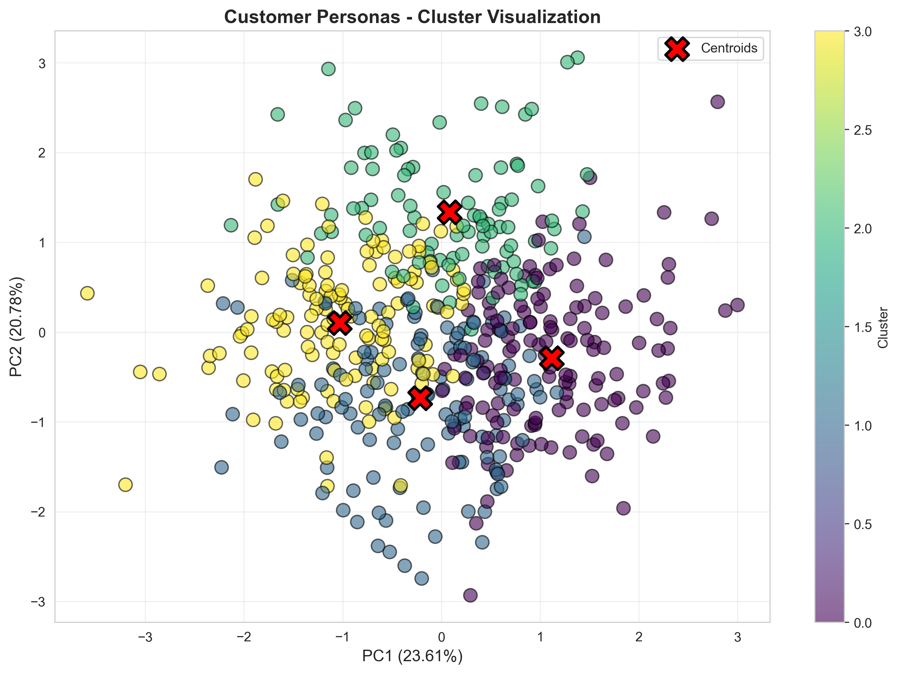 | 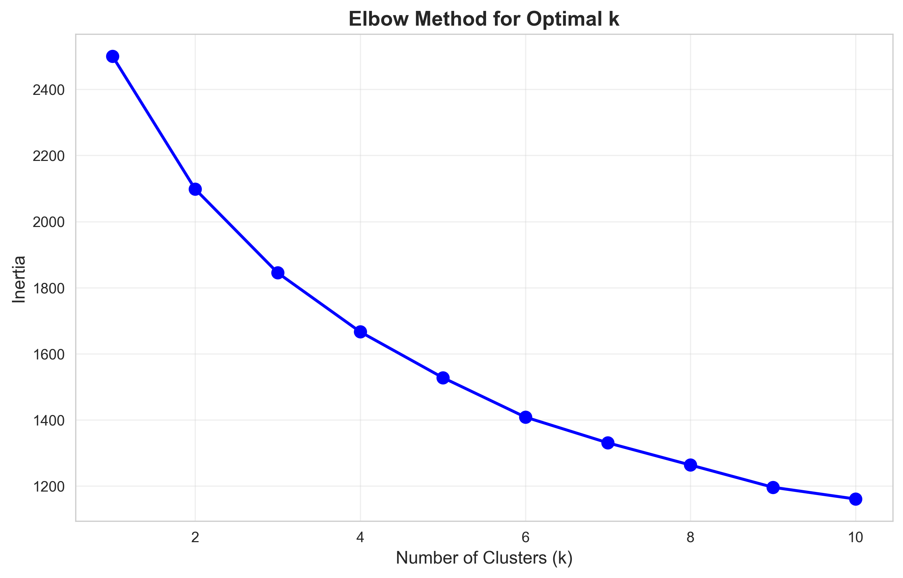 |

| Sales Trend Analysis | Sales Forecasting |
|:---:|:---:|
| 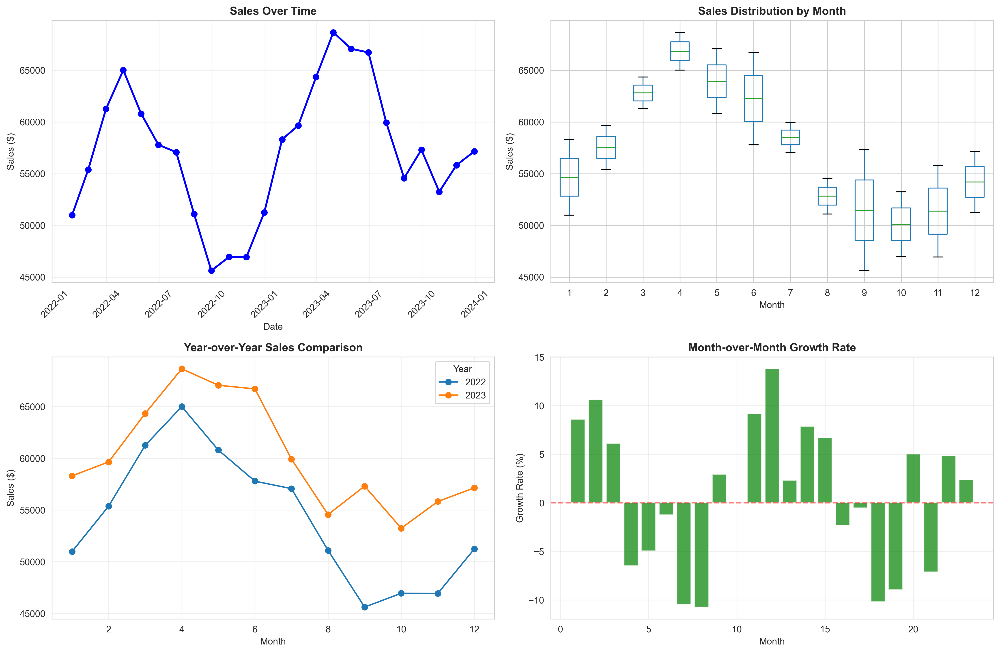 | 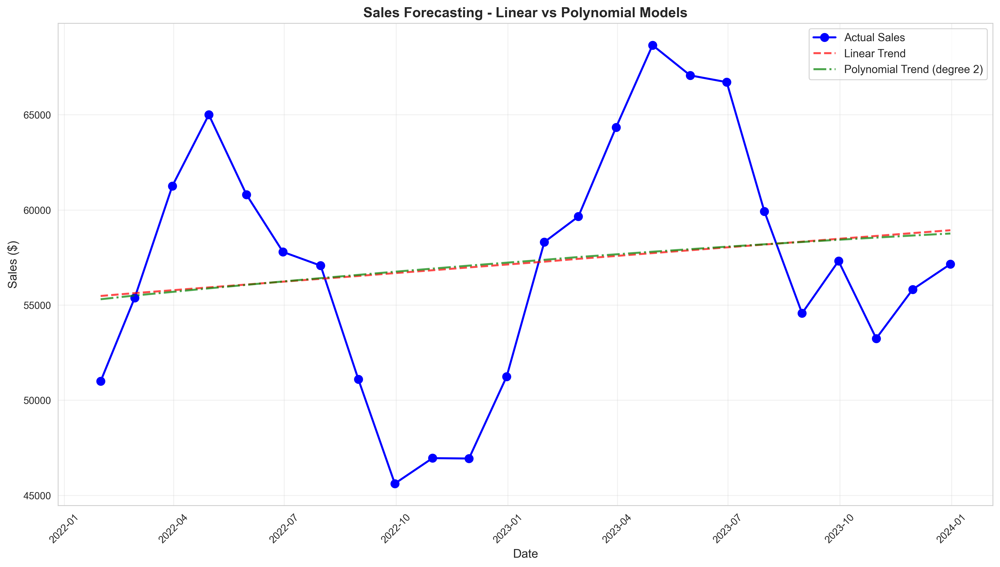 |

</div>

---

### 🎯 **Days 7-11: Feature Engineering & Advanced ML**
*Transformations, Computer Vision & ML Pipelines*

The second phase introduced advanced preprocessing techniques and computer vision fundamentals:

- **Day 7 - Feature Transformation**: Explored scaling methods (StandardScaler, MinMaxScaler, RobustScaler), power transformations, and PCA dimensionality reduction
- **Day 8 - Vision AI**: Implemented fundamental image processing techniques including edge detection, morphological operations, and color space transformations
- **Day 9 - Advanced Vision**: Developed contour detection, shape classification, and color-based segmentation algorithms
- **Day 10 - Creative AI**: Built text analysis systems with n-gram extraction, Markov chain text generation, and Zipf's law visualization
- **Day 11 - ML Pipelines**: Created end-to-end ML pipelines comparing Linear, Polynomial, Random Forest, and Gradient Boosting models with cross-validation

**📸 Visualizations:**

<div align="center">

| Feature Transformations | PCA Analysis |
|:---:|:---:|
| 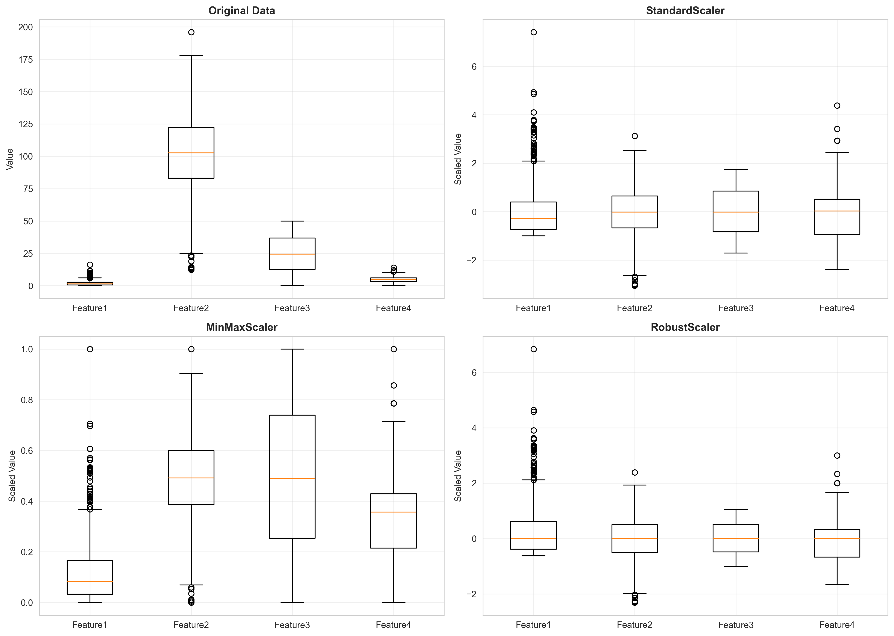 |  |

| Original Features | Feature Correlation |
|:---:|:---:|
| 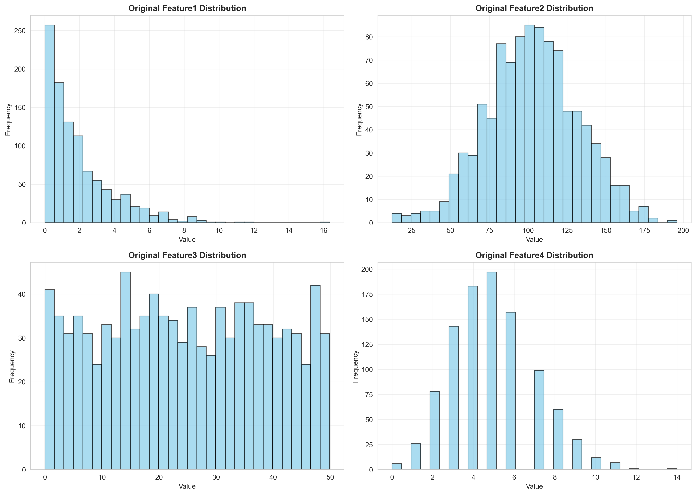 | 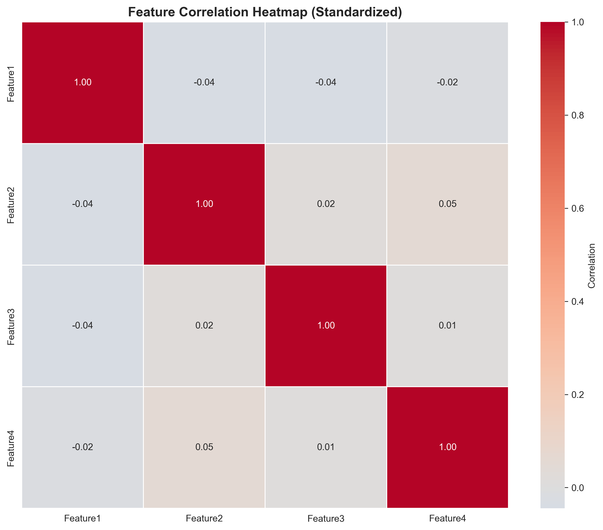 |

</div>

---

### 🚀 **Days 12-15: Deep Learning & Advanced Techniques**
*Object Detection, Neural Networks & Database Integration*

Phase three dove into deep learning architectures and complex AI applications:

- **Day 12 - Object Detection**: Implemented contour-based object detection with bounding boxes, confidence scoring, and Non-Maximum Suppression
- **Day 13 - Deep Learning**: Built neural networks from scratch with forward/backward propagation, comparing multiple architectures and visualizing decision boundaries
- **Day 14 - Text Generation & NLP**: Developed comprehensive NLP systems including tokenization, n-grams, co-occurrence matrices, and language model concepts
- **Day 15 - SQL Integration**: Created SQLite databases with multi-table schemas, performing complex queries with JOINs, GROUP BY, and aggregations

**📸 Visualizations:**

<div align="center">

| Housing Model Performance | Correlation Matrix |
|:---:|:---:|
|  | 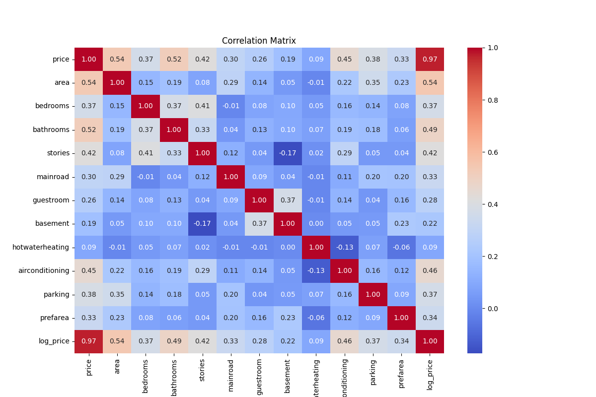 |

</div>

---

### 💼 **Days 16-21: Production Systems & Automation**
*OCR, Web Data, RAG, Financial Analysis & AI Orchestration*

The final phase focused on production-ready AI systems and automation:

- **Day 16 - OCR (Optical Character Recognition)**: Built text extraction pipeline with image preprocessing, text region detection, and performance metrics
- **Day 17 - Internet Data Collection**: Simulated web scraping with social media analytics, news engagement analysis, and traffic time series
- **Day 18 - RAG (Retrieval Augmented Generation)**: Implemented document vectorization with TF-IDF, query retrieval ranking, and document clustering
- **Day 19 - Market Analyst**: Created financial analysis system with stock simulation, moving averages, risk metrics (Sharpe ratio), and portfolio optimization
- **Day 20 - AI Agent**: Developed multi-agent simulation framework with decision-making, learning, and collaborative task execution
- **Day 21 - n8n Workflow Automation**: Built workflow orchestration system with node pipelines, performance tracking, and bottleneck analysis

**📸 Visualizations:**

<div align="center">

| Stock Analysis | Risk-Return Analysis |
|:---:|:---:|
| 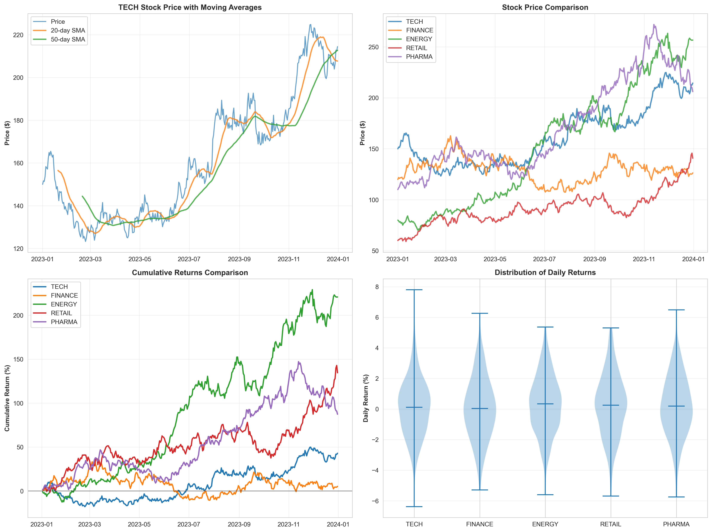 | 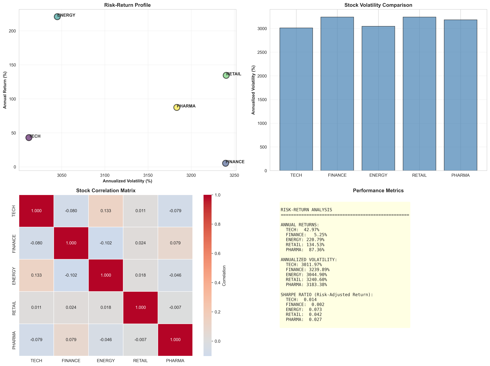 |

| Portfolio Analysis | Market Insights |
|:---:|:---:|
| 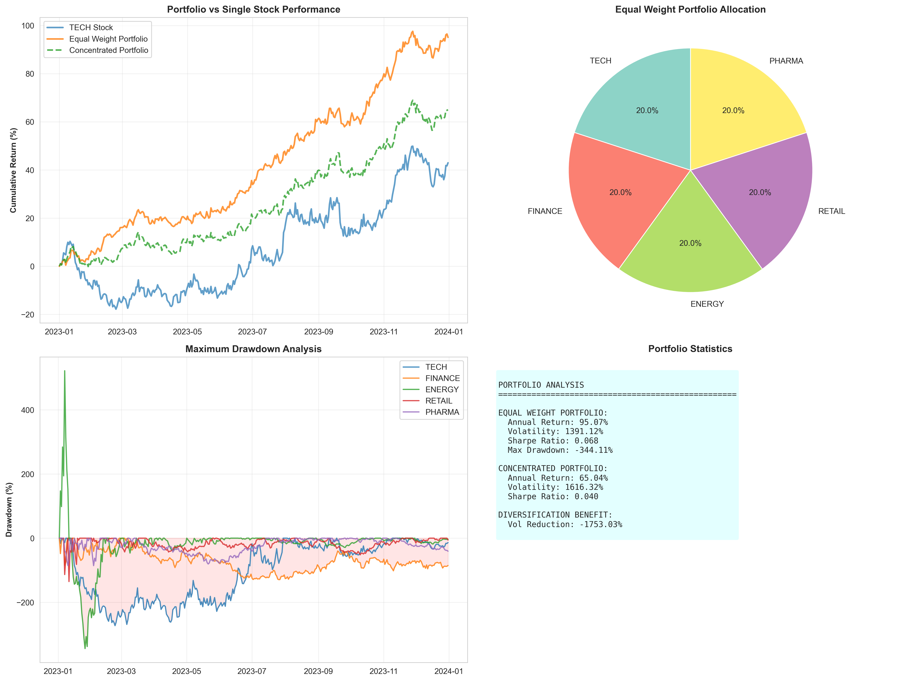 | 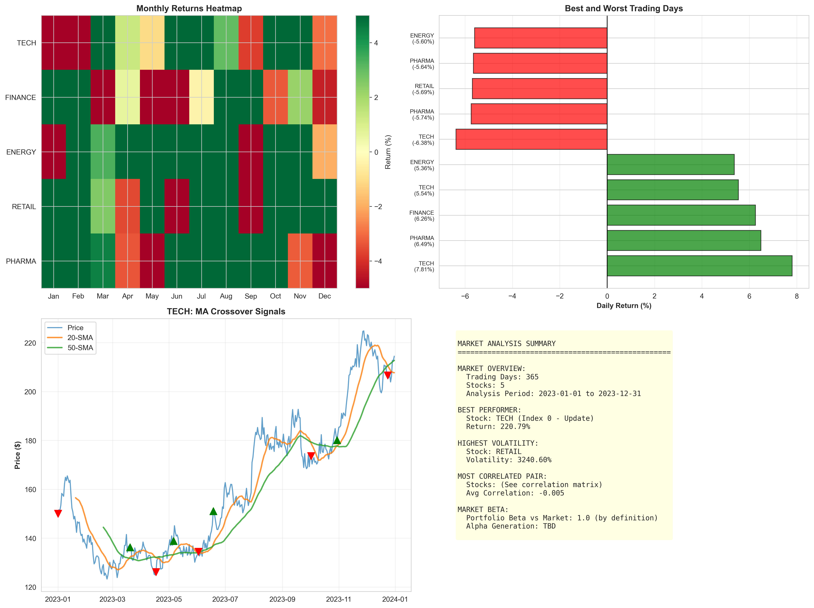 |

| Workflow Performance | Workflow Health |
|:---:|:---:|
| 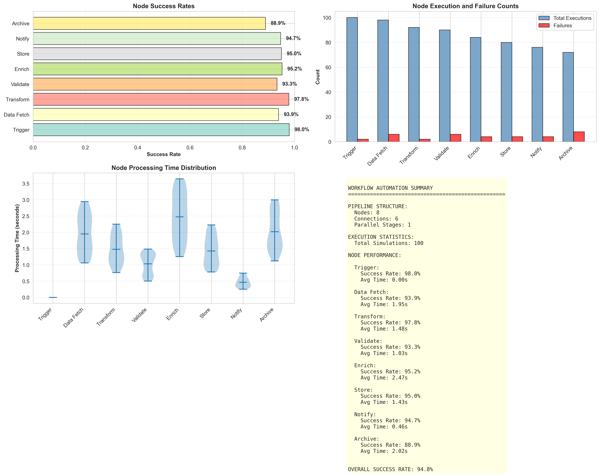 | 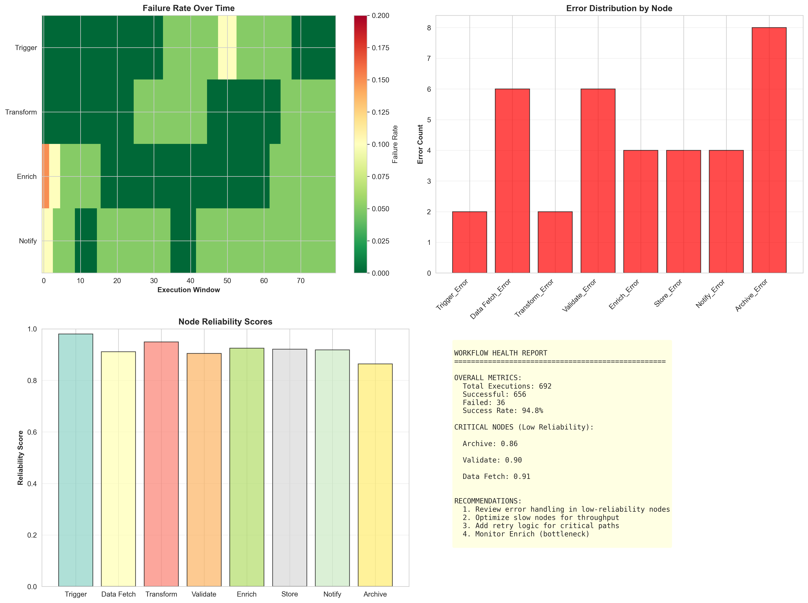 |

</div>

---

## 🛠️ Technical Stack

**Languages & Libraries:**
- Python 3.x
- pandas, numpy, matplotlib, seaborn
- scikit-learn (ML algorithms, pipelines, preprocessing)
- OpenCV (Computer Vision)
- SQLite (Database)
- PIL/Pillow (Image processing)

**Key Concepts Covered:**
- Supervised Learning (Regression, Classification)
- Unsupervised Learning (Clustering, PCA)
- Deep Learning (Neural Networks from scratch)
- Computer Vision (Edge detection, Object detection, OCR)
- Natural Language Processing (Tokenization, TF-IDF, N-grams)
- Time Series Analysis
- Financial Analytics
- Multi-Agent Systems
- Workflow Automation

---

## 📁 Repository Structure

```
GFG21-main/
├── Day 1 - 6/              # Foundation projects
│   ├── GFGDay1_Titanic_EDA.py
│   ├── GFGDay2_Netflix.py
│   ├── GFGday3_HousingPredication.py
│   ├── GFGday4_classification.py
│   ├── GFGDay5_customerPersonaAI.py
│   └── GFGDay6_Sales.py
│
├── Day 7 - 15/             # Advanced ML & DL
│   ├── GFGday7_FeatureTransformation.py
│   ├── GFGDay8_VisionAI.py
│   ├── GFGDay9_AdvancedVision.py
│   ├── GFGDay10_CreativeAI.py
│   ├── GFGDay11_Pipelines.py
│   ├── GFGDay12_ObjDect.py
│   ├── GFGDay13_DL.py
│   ├── GFGDay14_TextGen.py
│   └── GFGDay15_SQL.py
│
├── Day 16 -21/             # Production systems
│   ├── GFGDay16_OCR.py
│   ├── GFGDay17_Internet.py
│   ├── GFGDay18_RAG.py
│   ├── GFGDay19_MarketAnalyst.py
│   ├── GFGDay20_AIAgent.py
│   └── GFGDay21_n8n.py
│
├── outputs/                # Generated visualizations
│   └── *.png              # All output images
│
├── Housing.csv            # Dataset
├── netflix_titles.csv     # Dataset
└── README.md              # This file
```

---


